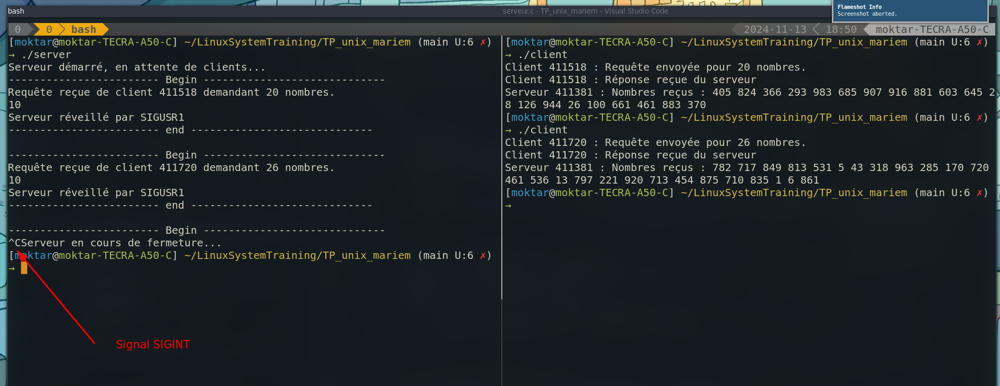

RealisationTP unix:  
Create a Client/Server communication using named pipes

## Testing
i used Unity framework for testing.  
i created 2 function `test_server` & `test_client`, to test the communication. 
- The client will send an N integer to fifo1  
- The server will respond in FiFo2 with N elements  
- So i prefixed the N to be 4 and the N elements to be `{3,2,1,0}` 
this is my test case, the picture bellow shows the result `Test is success` 

